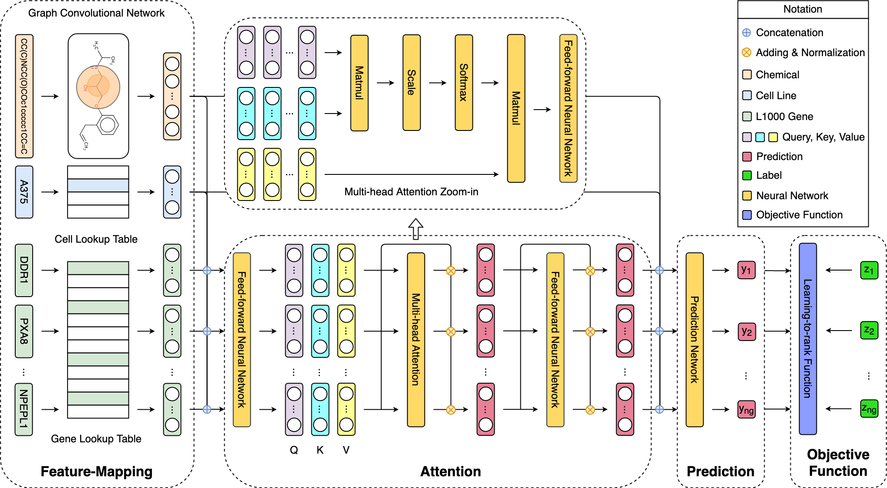
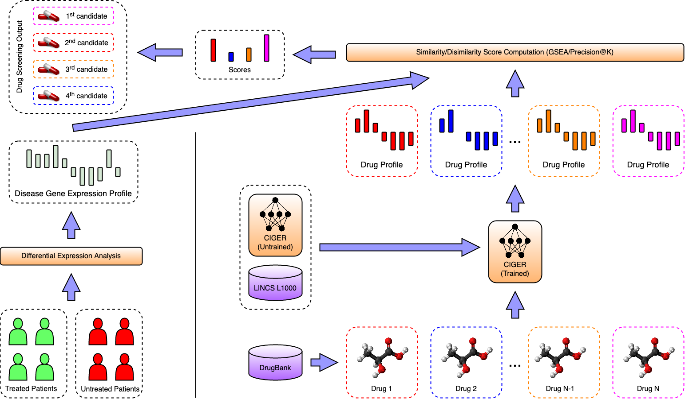

CIGER - Chemical-induced Gene Expression Ranking


# CIGER - Chemical-induced Gene Expression Ranking
-----------------------------------------------------------------
Code by **Thai-Hoang Pham** at Ohio State University.

## 1. Introduction
**CIGER** is a Python implementation of the neural network-based model that predicts the rankings of genes in the whole 
chemical-induced gene expression profiles given molecular structures.

The experimental results show that CIGER significantly outperforms existing methods in both ranking and classification 
metrics for gene expression prediction task. Furthermore, a new drug screening pipeline based on CIGER is proposed to 
select potential treatments for pancreatic cancer from the DrugBank database, thereby showing the effectiveness of 
**CIGER** for phenotypic compound screening of precision drug discovery in practice.

## 2. CIGER architecture



Figure 1: Overall architecture of **CIGER**

## 3. Pipeline



Figure 2: Drug screening pipeline using **CIGER**. This model is trained with the LINCS L1000 dataset to learn the 
relation between gene expression profiles and molecular structures (i.e., SMILES). Then molecular structures retrieved 
from the DrugBank database are put into **CIGER** to generate the corresponding gene expression profiles. Finally, 
these profiles are compared with disease profiles calculated from treated and untreated samples to find the most 
potential treatments for that disease.

## 4. Installation

**CIGER** depends on Numpy, SciPy, PyTorch (CUDA toolkit if use GPU), scikit-learn, tqdm, and RDKit.
You must have them installed before using **CIGER**.

The simple way to install them is using conda:

```sh
	$ conda install numpy scipy scikit-learn rdkit pytorch tqdm
```
## 5. Usage

### 5.1. Data

The datasets used to train **CIGER** are located at folder ``CIGER/data/``

### 5.2. Training CIGER

The training script for **CIGER** is located at folder ``CIGER/``. The Python script is ``train.py``. Example of 
running this script is in ``train.sh``.

```sh
    $ cd CIGER
    $ bash train.sh
```

Important Arguments:

``--fp_type``: Chemical representation method. Select between ECFP and neural FP.

``--label_type``: Gene expression label used for training. Select from **real**, **real reverse**, **binary**, 
and **binary reverse**. **real**: Training with gene expression values (z-scores). **real reverse**: Training with 
reversed gene expression values. **binary**: gene expression values are converted to binary values with top 95th 
percentile values as positive label. *binary_reverse*: gene expression values are converted to binary values with 
bottom 5th percentile values as positive label.

``--loss_type``: Learning-to-rank objective function. Select from **pairwise_ranknet**, **list_wise_listnet**, 
**list_wise_listmle**, **list_wise_rankcosine**, **list_wise_ndcg**.


Scripts for pancreatic cancer are located at folder ``CIGER/drug_repurposing/``

```sh
    $ cd CIGER/drug_repurposing
    $ python drug_repurposing_precision.py # using precision score
    $ python drug_repurposing_gsea.py # using enrichment score
```

## 6. Contact

**Thai-Hoang Pham** < pham.375@osu.edu >

Department of Computer Science and Engineering, Ohio State University, USA
